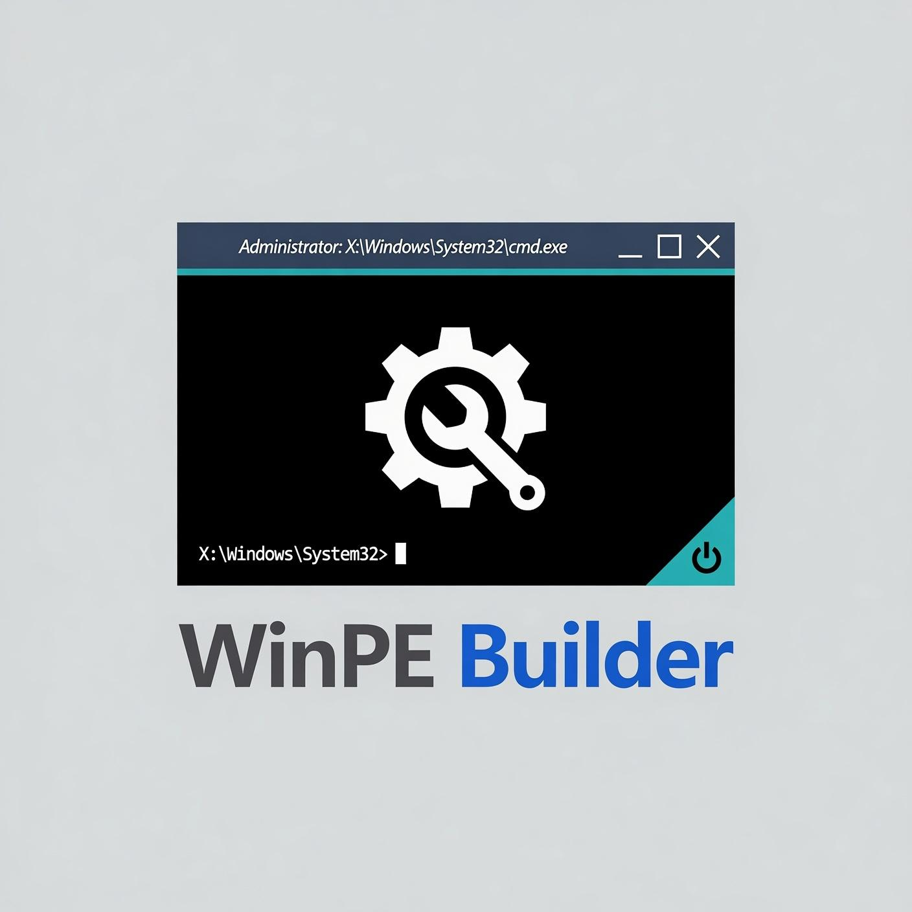

<p align="center">
  
</p>

# WinPE Builder 2.0 — Simple Guide

> **This is the main how-to.**  
> Recipes → [COMMON-USES.md](COMMON-USES.md) · All options → [USAGE.md](USAGE.md) · Overview → [README](../README.md)

End-to-end walkthrough for **version 2.0**. Run **PowerShell as Administrator**.

**Requires:** Windows **ADK** + **WinPE add-on** (install both).  
Download: [ADK install page](https://learn.microsoft.com/en-us/windows-hardware/get-started/adk-install)

If either is missing, the script stops and prints what to install plus that link.

| Name | Correct form |
|------|----------------|
| Script | `WinPE-Builder.ps1` |
| Version | **2.0** |
| Project path | `-WorkDirectory` |
| Package list file | `packages.pe` (created on `-Init`) |
| Modern Secure Boot | `-PCA2023` |

---

## Step-by-step (first project)

### 1. Create the project (`-Init`)

From the folder that contains `WinPE-Builder.ps1` (for example after extracting the ZIP):

```powershell
cd C:\path\to\extracted\WinPEBuilder

# Project = this folder
.\WinPE-Builder.ps1 -Init -WorkDirectory .

# Or project = another path you choose
# .\WinPE-Builder.ps1 -Init -WorkDirectory C:\MyWinPE-Project
```

Creates:

- `Add-Drivers`, `Add-Scripts`, `Add-Updates`, `WinPE-Root`, `WinPE-ISO`, `WinPE-Logs`
- **`packages.pe`** — default optional components **on**, other ADK OCs listed as comments

Project path is remembered for **this PowerShell window**.

> **`-Init` rebuilds `WinPE-Root`.** Use only for a **new** project (or a full reset).  
> Later sessions → [step 6 (resume)](#6-resume-later-new-powershell-window).  
> Existing `packages.pe` is **not** overwritten on re-Init.

**Optional — start from your own WinPE `boot.wim`:**

```powershell
.\WinPE-Builder.ps1 -Init -WorkDirectory . `
  -BootWimPath ".\path\to\your\boot.wim"
```

`-BootWimPath` is **Init only** (alias: `-CustomBootWimPath`). After copype, your file replaces `WinPE-Root\media\sources\boot.wim`. Details → [USAGE — Custom boot.wim](USAGE.md#custom-bootwim--bootwimpath).

---

### 2. Mount the image (optional)

Only if you want to browse or edit files by hand:

```powershell
.\WinPE-Builder.ps1 -Mount
```

Browse: `<WorkDirectory>\WinPE-Root\mount`

---

### 3. Make customizations

All paths below are **inside your project** (`-WorkDirectory`).

#### A) Drop-in folders (recommended — applied on `-Build`)

| Folder / file | Put here |
|---------------|----------|
| `Add-Drivers\` | **Your** drivers (`.inf` packages) |
| `Add-Scripts\` | `startnet.cmd`, `winpe.jpg`, tools |
| `Add-Scripts\System32\` | Tools → image `Windows\System32` |
| `Add-Scripts\Root\` | Files → image root (`X:\`) |
| `Add-Scripts\Media\` | Files → boot media (`WinPE-Root\media`) |
| `Add-Updates\` | **Your** updates (`.msu`, `.cab`) |
| `packages.pe` | Which WinPE optional components to install (see below) |

- Copy **your** drivers into `Add-Drivers`.  
- Copy **your** scripts and tools into `Add-Scripts`.  
- Copy **your** updates into `Add-Updates`.  

`startnet.cmd` must keep `wpeinit`:

```cmd
@echo off
wpeinit
REM your commands here
```

#### B) Package list (`packages.pe`)

Created on Init. Open `packages.pe` in any text editor.

| In the file | Meaning |
|-------------|---------|
| **Default Components** (no `#`) | Installed when you use this file |
| **Optional Components** (`# Name`) | Available on your ADK; **uncomment** to install |
| Line order | Install order (defaults are already dependency-safe) |

On Init, optional names come from your real ADK `WinPE_OCs\*.cab` folder (architecture-matched). Missing cabs are skipped with a warning during Build.

After editing, pass the file on Build:

```powershell
.\WinPE-Builder.ps1 -Build -ISO -Force -AddPackage packages.pe
```

Without `-AddPackage packages.pe`, Build uses the **built-in default list** only (same 11 packages), plus any extra names you pass.

Full rules → [USAGE — packages.pe](USAGE.md#packagespe-project-package-list).

#### C) Manual edits while mounted

Edit under `WinPE-Root\mount\...`, then save (step 4).

---

### 4. Save or discard mount edits

If you used `-Mount`:

```powershell
.\WinPE-Builder.ps1 -Save      # keep edits
.\WinPE-Builder.ps1 -Discard   # throw away
```

If you only use `Add-*` folders and `packages.pe`, skip Mount/Save and go to Build.

> **Note:** `-Build` alone (no `-ISO` / `-USB` / `-Save`) leaves the image **mounted**. Use `-Save` or `-Discard` when finished, or build with `-ISO`/`-USB` (commits automatically).

---

### 5. Build media

**ISO using your `packages.pe` (recommended after editing the file):**

```powershell
.\WinPE-Builder.ps1 -Build -ISO -Force -AddPackage packages.pe
```

**ISO with built-in defaults only** (no list file):

```powershell
.\WinPE-Builder.ps1 -Build -ISO -Force
```

**ISO + modern Secure Boot** (`-PCA2023` — only if PCs trust Windows UEFI CA 2023):

```powershell
.\WinPE-Builder.ps1 -Build -ISO -PCA2023 -Force -AddPackage packages.pe
```

**USB** (formats the stick):

```powershell
.\WinPE-Builder.ps1 -Build -USB F: -Force -AddPackage packages.pe
```

ISO path: `<WorkDirectory>\WinPE-ISO\WinPE_amd64_yyyyMMdd_HHmm.iso`

---

### 6. Resume later (new PowerShell window)

Do **not** run `-Init` again.

```powershell
.\WinPE-Builder.ps1 -WorkDirectory C:\MyWinPE-Project
.\WinPE-Builder.ps1 -Build -ISO -Force -AddPackage packages.pe
```

Or, if the project is the extracted ZIP folder:

```powershell
cd C:\path\to\extracted\WinPEBuilder
.\WinPE-Builder.ps1 -WorkDirectory .
.\WinPE-Builder.ps1 -Build -ISO -Force -AddPackage packages.pe
```

---

## Full example (copy-paste)

```powershell
cd C:\path\to\extracted\WinPEBuilder

.\WinPE-Builder.ps1 -Init -WorkDirectory .

# Optional: copy your drivers into Add-Drivers
# Optional: edit Add-Scripts\startnet.cmd and packages.pe

.\WinPE-Builder.ps1 -Build -ISO -Force -AddPackage packages.pe
# or: .\WinPE-Builder.ps1 -Build -ISO -PCA2023 -Force -AddPackage packages.pe
```

---

## Quick “what do I run?”

| Goal | Command |
|------|---------|
| New project (ZIP folder) | `-Init -WorkDirectory .` |
| New project (custom path) | `-Init -WorkDirectory C:\MyWinPE-Project` |
| Custom base WIM | `-Init … -BootWimPath ".\path\to\your\boot.wim"` |
| Resume | `-WorkDirectory .` or `-WorkDirectory C:\MyWinPE-Project` |
| Edit packages | Open `packages.pe` in a text editor |
| ISO with package list | `-Build -ISO -Force -AddPackage packages.pe` |
| ISO (built-in defaults only) | `-Build -ISO -Force` |
| ISO + PCA2023 | `-Build -ISO -PCA2023 -Force -AddPackage packages.pe` |
| USB | `-Build -USB F: -Force -AddPackage packages.pe` |
| Stuck mount | `-Discard` or `-Clean -Force` |

---

## Other options (outline only)

Full tables → **[USAGE.md](USAGE.md)**.

| Option | Purpose |
|--------|---------|
| `-Architecture` | `amd64` (default), `x86`, `arm64` |
| `-Language` / `-TimeZone` | Locale (default `en-us` / Eastern) |
| `-ScratchSpace` | PE temp space MB (default 256) |
| `-AddPackage` | OC names and/or `packages.pe` list file |
| `-NoDefaultPackages` | Skip built-in defaults when **not** using a list file as the full set |
| `-BootWimPath` | Custom `boot.wim` on **Init only** |
| `-Clean` | Clear mounts (`-Force` = global DISM cleanup) |
| `-PCA2023` | Sign media with Windows UEFI CA 2023 |

**Default Secure Boot:** PCA **2011**. Use `-PCA2023` only when the fleet trusts the 2023 CA ([USAGE § Secure Boot](USAGE.md#secure-boot--pca2023)).
